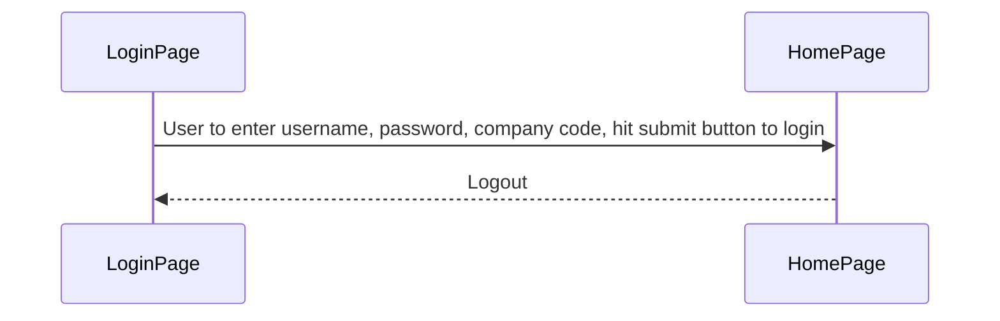
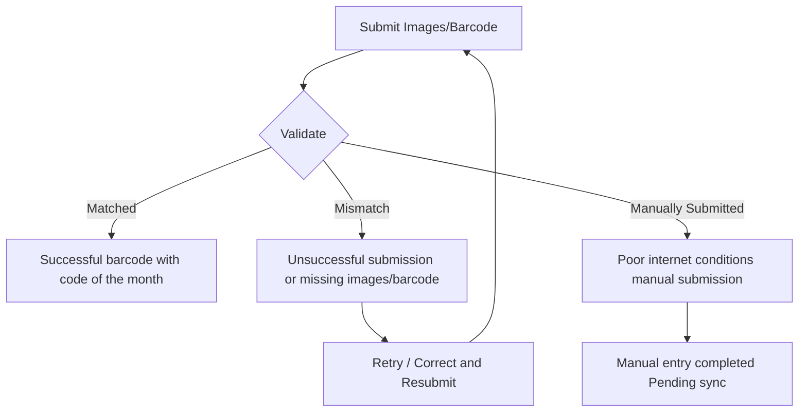
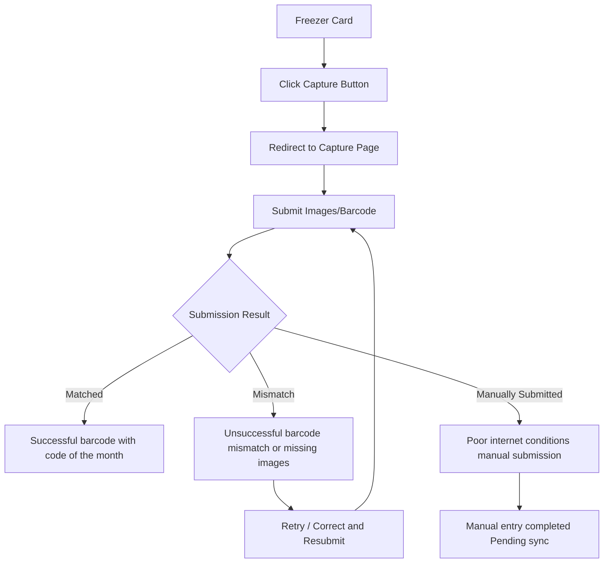
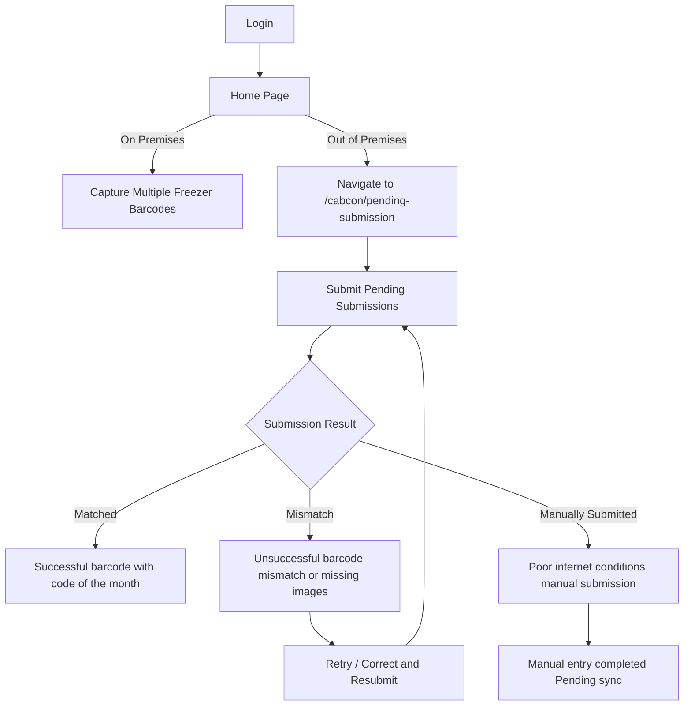

# Application Flow

## Login to Home Page Flow

Typical flow for users loging-in

### Diagram

---

## General Cabcon Submission

The submission procedure is identical regardless of merchant type (distributor, dealer, or franchisee). Any freezer located on the merchant's premises is automatically assigned to them.

Flow:
Submit -> Validate -> Result

---

## Submission Outcomes

All flows share the same submission result handling:

### 1. Matched

- Successful submission of barcode with code of the month

### 2. Mismatch

- Unsuccessful submission of barcode with code of the month
- Submitted images without the barcode and code of the month

### 3. Manually Submitted

- Manual submission allowed where internet connections are in poor conditions

---

## Cabcon Submission Process

**Code of the Month Validation**

->> Api call to retrieve the current Cabcon Code of the Month

->> Retrieve the code of the month that is watermarked on the captured image

->> Validate the equality of retrieved code of the month (via api call) with the code of the month watermarked from the image (via tesseract)

**Barcode Validation**

->> Retrieve the barcode from the captured image (via html5qrcode)

->> Make api call to retrieve freezer with the barcode

**Submit**

->> Logically freezer/s are assigned automatically where it is deployed to merchant's premises as stated in the general cabcon submission

```mermaid
sequenceDiagram
    participant U as User
    participant S as Submission Service
    participant A as API
    participant R as Reader (Tesseract / html5qrcode)

    alt Good Internet Connection
        U->>S: Capture Freezer Images
        S->>A: Retrieve Code of the Month
        A-->>S: Return current code
        S->>R: Extract watermarked code from image
        R-->>S: Return watermark code
        S->>S: Validate codes match

        alt Code matched
            S->>R: Extract barcode from image
            R-->>S: Return barcode
            S->>A: Retrieve freezer by barcode
            A-->>S: Return freezer data
            S->>S: Assign freezers to merchant premises
            S-->>U: Cabcon Submitted Successfully - Matched Result
        else Code mismatch
            S-->>U: Mismatch Result (barcode/code not found)
        end
    else Poor Internet Connection
        U->>S: Submit Manually (no network)
        S-->>U: Manually Submitted - Pending sync
    end
```

## Hapistore Cabcon Submission (Home Page)

User navigates to freezer card, click on the capture button and redirects to capture page.

**Use case:** This flow handles 5 or less freezer assets on user's premises.

- store | convenience store | etc.

_Submission outcomes: [See above](#submission-outcomes)_

---

## Dealer Cabcon Submission (Home Page)

### Flow 1: Single Freezer Capture

User navigates to freezer card, click on the capture button and redirects to capture page.

**Use case:** Handles up to 5 freezers within the user's available time.

- store | warehouse | etc.

_Submission outcomes: [See above](#submission-outcomes)_

---

### Flow 2: Batch Capture

User may click on the capture button in the home page, after that the user redirects to capture page and later back on the app.

**Sequence on the premises:**
login → homepage → click capture button → redirect to capture page → capture multiple freezer barcodes

**Sequence out of the premises:**
login → homepage → navigate to /cabcon/pending-submission → do the submission activity

**Use case:** Handles 5 or more freezer assets. Users capture multiple freezers on-site and complete submissions later via the app.

- store | warehouse | etc.

_Submission outcomes: [See above](#submission-outcomes)_

